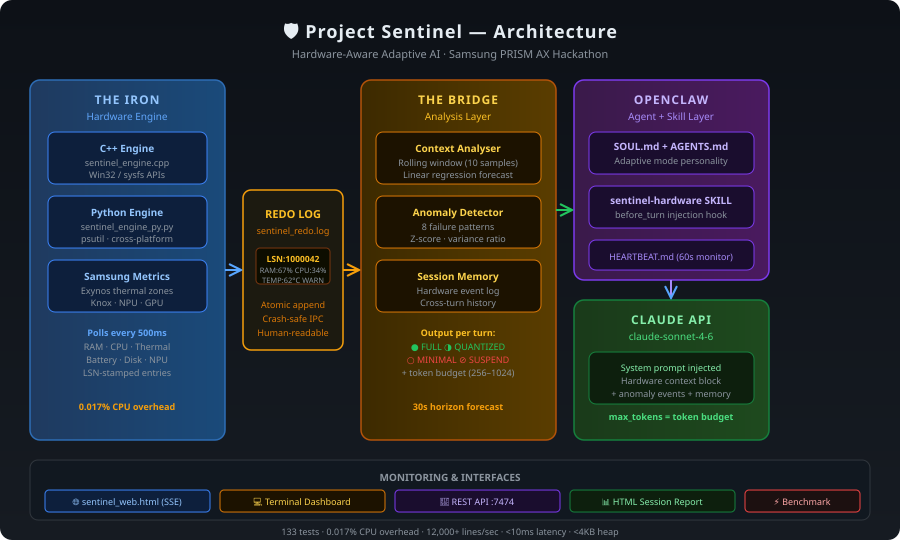

# 🛡️ Project Sentinel
### Hardware-Aware Adaptive AI for Samsung Galaxy Devices
**Samsung PRISM (AX) Hackathon — Theme 2: Daily Utility (Smartphones)**

---

## Problem

On-device AI agents are **hardware-blind**. They execute complex reasoning tasks without any awareness of the device's physical state — RAM pressure, thermal throttling, or battery health. The result is three failure modes every Galaxy user has experienced:

- **Thermal collapse** — the SoC throttles mid-inference, producing stuttered or corrupted responses
- **Memory kill** — the OOM killer terminates the AI process with no warning to the user
- **Battery drain cliff** — sustained inference pulls peak current, accelerating shutdown

Existing solutions react *after* the OS acts. We react *before*.

---

## Solution

**Sentinel** gives the AI agent a nervous system. A lightweight C++/Python telemetry engine polls hardware metrics every 500ms and writes them to an atomic redo log. A Python bridge tails the log, runs statistical analysis and anomaly detection, and injects a structured hardware-context block into the AI agent's system prompt before every conversation turn.

The agent — running on OpenClaw with Claude — reads this context and automatically adapts its operating mode, response depth, and token budget in real time.

```
C++/Python Engine          redo log             Python Bridge              OpenClaw + Claude
(polls every 500ms)  ────────────────▶  (tail + analyse + forecast)  ──▶  (adaptive agent)
RAM · CPU · thermal        atomic append        anomaly detection            FULL / QUANTIZED
battery · disk · NPU       LSN-stamped          linear regression            MINIMAL / SUSPEND
```

### Five Novel Contributions

1. **Multi-signal fusion** — RAM, CPU, thermal, battery, disk combined into one `pressure_state`
2. **Horizon forecasting** — linear regression predicts critical state 30 seconds ahead
3. **8-pattern anomaly detection** — Z-score, variance ratio, rate-of-change (RAM spike, thermal runaway, battery cliff, CPU thrash, and more)
4. **Per-turn context injection** — hardware re-sampled before every API call, not just at startup
5. **Session hardware memory** — agent remembers hardware events across the conversation

---

## Architecture



---

## Project Recoding 
The Recording has been uploaded in the GitHub under the folder name **RECORDING**.
Under the folder **RECORDING** you will find a VLC recording named as **RECORDING**

---

## Repository Structure

```
sentinel/
├── openclaw.json                     OpenClaw gateway config
├── openclaw/workspace/
│   ├── SOUL.md                       Agent personality & adaptive mode rules
│   ├── IDENTITY.md                   Agent identity (Sentinel)
│   ├── AGENTS.md                     Boot sequence & session rules
│   ├── HEARTBEAT.md                  Background monitoring (60s)
│   └── skills/sentinel-hardware/
│       ├── SKILL.md                  Custom OpenClaw skill manifest
│       └── run.py                    Skill entry point (hardware to system prompt)
├── engine/sentinel_engine.cpp        C++ hardware poller (Windows/Linux)
├── scripts/sentinel_engine_py.py     Python hardware poller (no compiler needed)
├── bridge/
│   ├── sentinel_bridge.py            Log watcher, ContextAnalyser, forecaster
│   ├── anomaly_detector.py           8-pattern statistical anomaly detector
│   └── samsung_metrics.py            Samsung-specific sysfs + Knox reader
├── agent/
│   ├── sentinel_agent.py             Standalone AI agent (Claude API)
│   └── sentinel_memory.py            Session hardware event memory
├── dashboard/
│   ├── sentinel_web.html             Live web dashboard (SSE streaming)
│   └── sentinel_dashboard.py         Terminal dashboard
├── scripts/
│   ├── sentinel_api.py               REST API server
│   ├── demo.py                       One-command automated demo
│   ├── benchmark.py                  Overhead benchmark (0.017% CPU verified)
│   ├── replay.py                     Session replay (5 built-in scenarios)
│   └── visualise_log.py              HTML session report generator
├── tests/                            133 tests (unit, integration, stress, property)
├── docs/DESIGN.md                    Architecture deep-dive
├── SUBMISSION.md                     Hackathon one-pager
├── AI_DISCLOSURE.md                  AI tools usage disclosure
└── README.md                         This file
```

---

## Setup Instructions

### Prerequisites

| Requirement | Version | Install |
|---|---|---|
| Python | 3.10+ | python.org/downloads |
| Node.js | 22+ | nodejs.org |
| OpenClaw | 2026.4.29+ | npm install -g openclaw@latest |
| Git | any | git-scm.com |

### Step 1 — Clone the repository

```bash
git clone https://github.com/kjudr05/project-sentinel.git
cd project-sentinel
```

### Step 2 — Install Python dependencies

```bash
pip install anthropic psutil pytest
```

### Step 3 — Configure OpenClaw

Get your API key from console.anthropic.com/settings/keys, then:

```bash
openclaw onboard --anthropic-api-key "sk-ant-YOUR-KEY-HERE"
```

### Step 4 — Verify everything works

```bash
python -m pytest tests/ -v
```

Expected: **133 passed, 0 failed**

---

## Usage

### Instant demo (no API key needed, ~60 seconds)

```bash
python scripts/demo.py --quick
```

### Web dashboard

Open `dashboard/sentinel_web.html` in any browser. Auto-starts Full Cycle demo.

### API server + live dashboard

```bash
# Terminal 1
python scripts/sentinel_api.py --mock warn

# Then open dashboard/sentinel_web.html in browser
```

### AI agent REPL

```bash
python agent/sentinel_agent.py --mock nominal
python agent/sentinel_agent.py --mock critical
```

### One-command all-in-one (recommended for demos)

```bash
# Starts engine + API server + opens dashboard in browser
python scripts/sentinel_monitor.py --mock warn

# With live hardware
python scripts/sentinel_monitor.py
```

### Full OpenClaw mode

```bash
python scripts/sentinel_engine_py.py          # Terminal 1: start hardware engine
openclaw gateway --config openclaw.json       # Terminal 2: start OpenClaw
openclaw dashboard                            # opens browser UI
```

### Session report

```bash
python scripts/visualise_log.py --demo
# Generates sentinel_demo_report.html
```

---

## Performance

| Metric | Value |
|---|---|
| Bridge CPU overhead | 0.017% at 500ms poll |
| Parse throughput | 12,000+ lines/sec |
| Write to callback latency | < 10ms |
| Bridge heap footprint | < 4 KB |
| Test suite | 133 tests, 0 failures |

---

## APK / SDK Note

This submission targets Samsung Galaxy Linux userspace and Windows. The Python engine runs on Android via Termux without modification. An Android NDK wrapper for the C++ engine is the planned next step.

---

## License

Apache 2.0

## Team

Kavya — kjudr05 — Samsung PRISM AX Hackathon 2026
